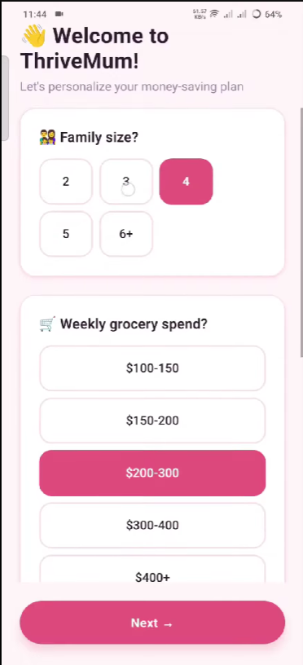
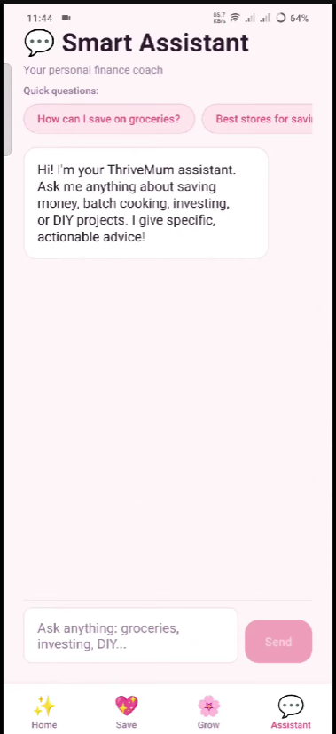
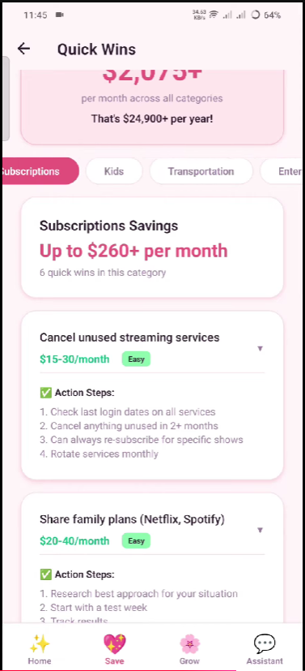

# ThriveMum - Finance For Moms

A React Native mobile app helping busy moms take control of their finances with personalized AI-powered advice, smart shopping tools, and investment guidance.


## 🌟 Features

### 💰 Smart Money Management
- **AI Financial Assistant** - Get instant, personalized advice powered by Google Gemini AI
- **Emergency Fund Tracker** - Build your safety net with guided savings goals
- **Investment Simulator** - Learn investing basics risk-free before committing real money
- **Investment Guide** - Step-by-step tutorials for beginner investors

### 🛒 Shopping & Savings
- **Smart Shopping** - Compare grocery prices and find the best deals
- **Grocery Savings Calculator** - Track how much you're saving with smart choices
- **Batch Cooking Planner** - Plan weekly meals to cut food costs by 40%

### 🏠 Home Economics
- **DIY Home Savings** - Calculate savings from doing projects yourself
- **Quick Wins** - Fast, actionable tips to save money today

### 🌱 Growth Features
- **Onboarding Experience** - Personalized setup for your financial journey
- **Progress Tracking** - Visual dashboards showing your financial growth

## 📱 Screenshots





## 🚀 Getting Started

### Prerequisites

- **Node.js** (v16 or higher)
- **npm** or **yarn**
- **Expo CLI** (installed globally)
- **Android Studio** (for Android development)
- **Xcode** (for iOS development, macOS only)

### Installation

1. **Clone the repository**
   ```bash
   git clone <repository-url>
   cd "finance for moms"
   ```

2. **Install dependencies**
   ```bash
   npm install
   ```

3. **Set up environment variables**
   
   Copy the example environment file:
   ```bash
   cp .env.example .env
   ```
   
   Edit `.env` and add your Google Gemini API key:
   ```env
   GEMINI_API_KEY=your_api_key_here
   GEMINI_API_URL=https://generativelanguage.googleapis.com/v1beta/models/gemini-1.5-pro:generateContent
   ```
   
   Get your free API key from [Google AI Studio](https://makersuite.google.com/app/apikey)

4. **Start the development server**
   ```bash
   npm start
   ```

### Running on Devices

**Android:**
```bash
npm run android
```

**iOS:**
```bash
npm run ios
```

**Web:**
```bash
npm run web
```

## 🏗️ Project Structure

```
finance-for-moms/
├── android/                 # Android native code
├── components/             # Reusable UI components
│   ├── AppButton.js       # Custom button component
│   ├── Card.js            # Card container component
│   └── ProgressBar.js     # Progress visualization
├── screens/               # App screens/pages
│   ├── HomeScreen.js      # Main dashboard
│   ├── AssistantScreen.js # AI chat interface
│   ├── SaveScreen.js      # Savings features hub
│   ├── GrowScreen.js      # Investment features hub
│   └── ...                # Other feature screens
├── services/              # External integrations
│   ├── geminiApi.js       # Google Gemini AI integration
│   └── mockApi.js         # Mock data for development
├── utils/                 # Utilities and helpers
│   └── theme.js           # App-wide theme configuration
├── .env                   # Environment variables (not in git)
├── .env.example           # Environment template
├── App.js                 # Root component
└── package.json           # Dependencies and scripts
```

## 🛠️ Tech Stack

- **Framework:** React Native 0.81.5
- **Build Tool:** Expo 54.0.33
- **UI Library:** React Native Components
- **Navigation:** React Navigation 6.x
- **State Management:** React Hooks + AsyncStorage
- **AI Integration:** Google Gemini 1.5 Pro
- **Language:** JavaScript (ES6+)

## 📦 Key Dependencies

```json
{
  "@react-navigation/native": "^6.1.18",
  "@react-navigation/bottom-tabs": "^6.5.20",
  "@react-native-async-storage/async-storage": "^2.2.0",
  "expo": "^54.0.33",
  "react": "19.1.0",
  "react-native": "0.81.5"
}
```

## 🔑 Environment Variables

| Variable | Description | Required | Default |
|----------|-------------|----------|---------|
| `GEMINI_API_KEY` | Google Gemini API key for AI assistant | Yes | - |
| `GEMINI_API_URL` | Gemini API endpoint | No | Pre-configured |

## 🎨 Features in Detail

### AI Financial Assistant
Powered by Google Gemini 1.5 Pro, the assistant provides:
- Personalized financial advice tailored to moms
- Context-aware responses based on app features
- Specific, actionable recommendations with real numbers
- Integration with other app features

### Investment Simulator
- Risk-free learning environment
- Simulate stock market investments
- Track hypothetical portfolio performance
- Learn investing concepts through practice

### Batch Cooking Planner
- Weekly meal planning interface
- Cost comparison: home cooking vs. takeout
- Recipe suggestions optimized for batch preparation
- Grocery list generation

## 🧪 Development

### Running Tests
```bash
npm test
```

### Building for Production

**Android:**
```bash
cd android
./gradlew assembleRelease
```

**iOS:**
```bash
npx expo build:ios
```

### Debugging

- Use React Native Debugger
- Enable remote debugging in Expo
- Check logs: `npx expo start` then press `j` for logs

## 📝 To-Do

- [ ] Add user authentication
- [ ] Implement cloud data sync
- [ ] Add more investment calculators
- [ ] Create receipt scanning feature
- [ ] Add budget categories tracking
- [ ] Implement push notifications
- [ ] Add social sharing features
- [ ] Create premium subscription tier

## 🙏 Acknowledgments

- Google Gemini AI for powering the financial assistant
- Expo team for the amazing development experience
- React Native community for excellent documentation
- All the moms who inspired this app

## 🔗 Links

- [Google Gemini API](https://makersuite.google.com/app/apikey)
- [Expo Documentation](https://docs.expo.dev/)
- [React Native Documentation](https://reactnative.dev/)
- [React Navigation](https://reactnavigation.org/)

---

**Made with ❤️ for moms everywhere**
